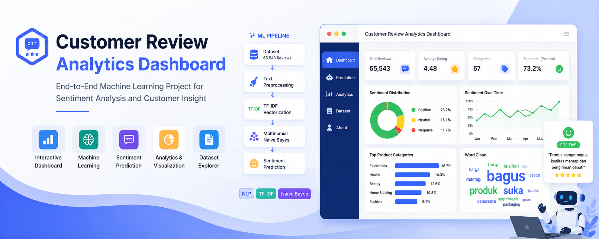
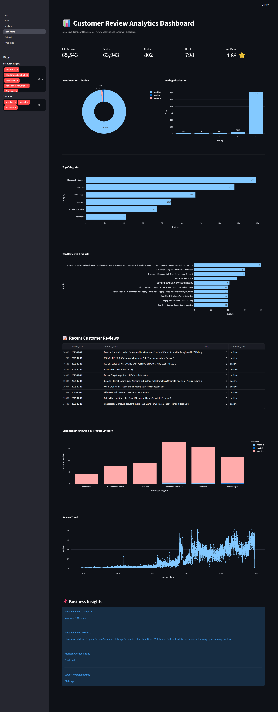
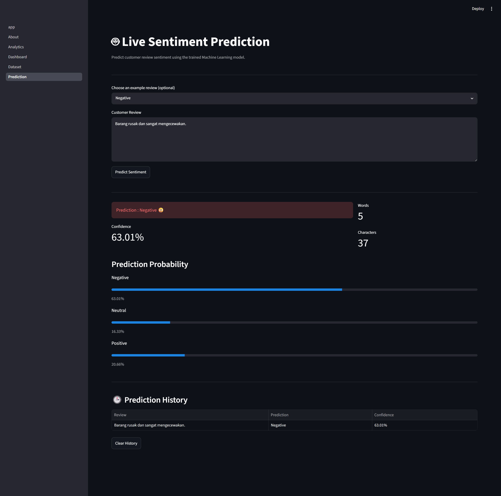
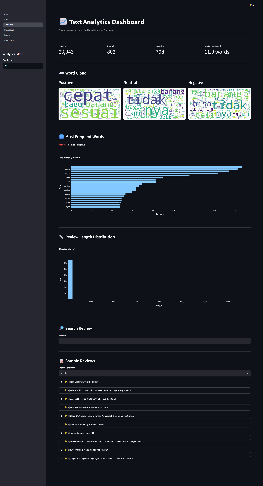
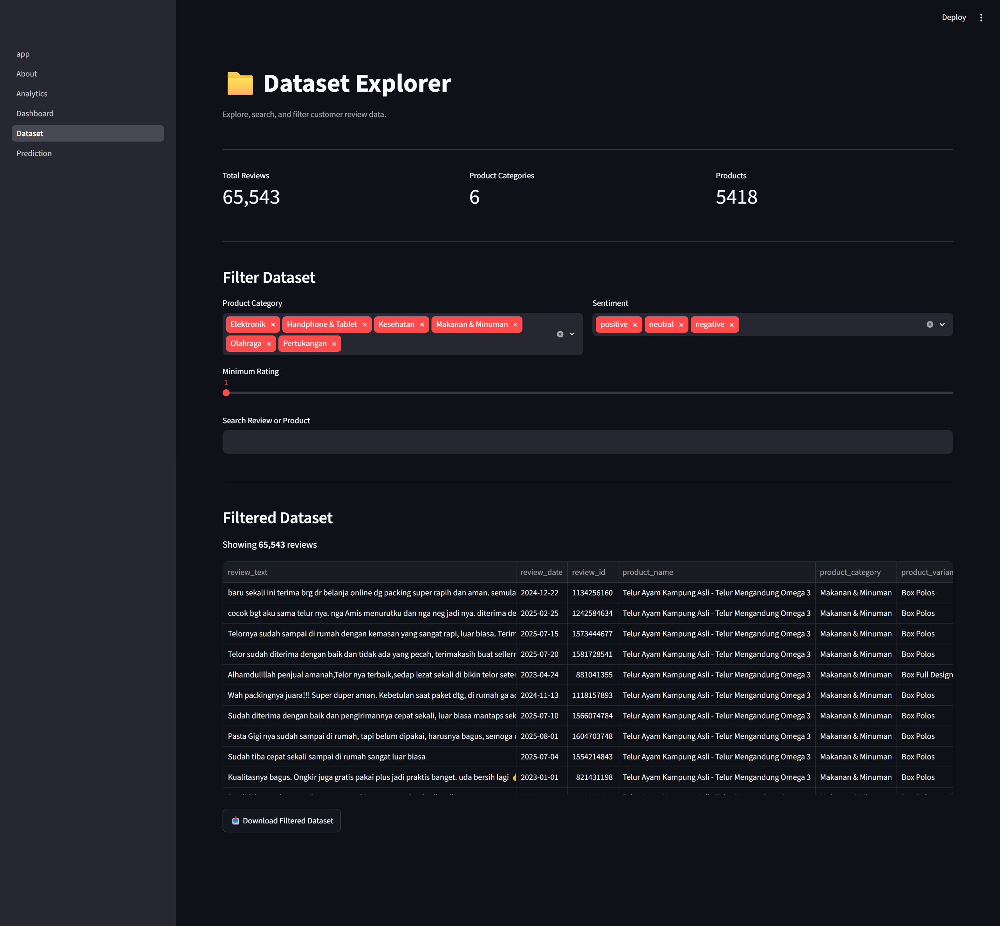

<p align="center">



</p>

<h1 align="center">
Customer Review Analytics Dashboard
</h1>

<p align="center">

An interactive Machine Learning dashboard for customer review analytics, sentiment prediction, and business insights.

</p>

<p align="center">

<a href="https://review-analytics-dashboard.streamlit.app">

</a>

<a href="https://github.com/myu9s2/customer-review-analytics-dashboard">

</a>


</p>

---

# Live Demo

https://review-analytics-dashboard.streamlit.app

---

# Project Overview

Customer Review Analytics Dashboard is an end-to-end Machine Learning application designed to analyze customer reviews from an e-commerce platform.

The project combines Natural Language Processing (NLP), sentiment classification, and interactive business analytics into a single Streamlit dashboard.

Users can explore customer feedback, predict review sentiment, analyze review patterns, and discover business insights through interactive visualizations.

---

# Key Features

- Interactive Dashboard
- Live Sentiment Prediction
- Customer Review Analytics
- NLP Word Cloud Analysis
- Review Search
- Dataset Explorer
- Business Insight
- Interactive Charts
- Multi-page Streamlit Application

---

# Dashboard Preview


| Dashboard | Prediction |
|------------|------------|
|  |  |

| Analytics | Dataset Explorer |
|------------|-----------------|
|  |  |

---

# Machine Learning Pipeline

```text
Customer Reviews
        │
        ▼
Text Preprocessing
        │
        ▼
TF-IDF Vectorization
        │
        ▼
Multinomial Naive Bayes
        │
        ▼
Sentiment Prediction
        │
        ▼
Interactive Dashboard
```

---

# Dataset

**Source**

Tokopedia Product Reviews

**Size**

- 65,543 Reviews
- 67 Product Categories
- Positive
- Neutral
- Negative

---

# Technology Stack

| Category | Technology |
|-----------|------------|
| Language | Python |
| Dashboard | Streamlit |
| Machine Learning | Scikit-learn |
| NLP | TF-IDF |
| Model | Multinomial Naive Bayes |
| Data Processing | Pandas, NumPy |
| Visualization | Plotly, Matplotlib |
| Text Visualization | WordCloud |
| Deployment | Streamlit Community Cloud |

---

# Project Structure

```text
customer-review-analytics-dashboard/

│

├── app.py

├── pages/

│ ├── Dashboard.py

│ ├── Prediction.py

│ ├── Analytics.py

│ ├── Dataset.py

│ └── About.py

│

├── utils/

├── models/

├── data/

├── assets/

└── screenshots/
```

---

# Installation

Clone repository

```bash
git clone https://github.com/myu9s2/customer-review-analytics-dashboard.git

cd customer-review-analytics-dashboard
```

Install dependencies

```bash
pip install -r requirements.txt
```

Run Streamlit

```bash
streamlit run app.py
```

---

# Future Improvements

- Transformer-based Sentiment Model (IndoBERT)
- Explainable AI (SHAP/LIME)
- Real-time Review Monitoring
- Database Integration
- REST API
- Authentication System

---

# Author

**Mochammad Yuga Ranapraja**

Informatics Student

Universitas Siliwangi

GitHub

https://github.com/myu9s2

LinkedIn

https://www.linkedin.com/in/m-yuga-ranapraja-968221289/

---

If you find this project helpful, feel free to ⭐ the repository.
